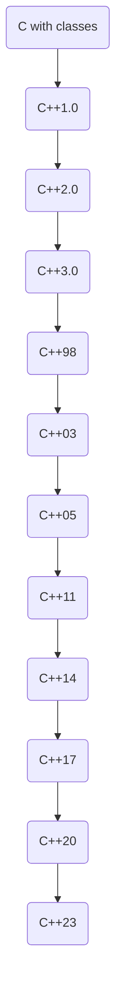
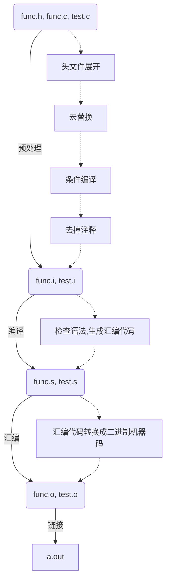

# C++入门

1. 什么是C++

> C语言是结构化和模块化的语言，适合处理较小规模的程序。对于复杂的问题，规模较大的程序，需要高度的抽象和建模时，C语言则不合适。为了解决软件危机，20世纪80年代，计算机界提出了O**OP(object oriented programming：面向对象)思想**，支持面向对象的程序设计语言应运而生。
>
> 1982年，Blarne Stroustrup博士在C语言的基础上引入并扩充了面向对象的概念，发明了一种新的程序语言。为了表达该语言与c语言的渊源关系，命名为C++。因此：C++是基于c语言而产生的，它既可以进行C语言的过程化程序设计，又可以进行**以抽象数据类型为特点的基于对象的**
> **程序设计，还可以进行面向对象的程序设计。**

2. C++发展史

>1979年，贝尔实验室的本贾尼等人试图分析unix内核的时候，试图将内核模块化，于是在C语言的基础上进行扩展，增加了类的机制，完成了一个可以运行的预处理程序，称之为C with
>classes.
>
>语言的发展就像是练功打怪升级一样，也是逐步递进，由浅入深的过程。我们先来看下C++的历史版本。



> ***C++98***: C++标准第一个版本，绝大多数编译器都支持，得到了国际标准化组织(ISO)和美国标准化协会认可，以模板方式重写C++标准库，引入了STL（标准模板库）
>
> ***C++11***: 增加了许多特性，使得C++更像一种新语言，比如：正则表达式、基于范围for循环、auto关键字、新容器、列表初始化、标准线程库等
>
> C++还在不断的向后发展。但是：现在公司主流使用还是***C++98和C++11***，所有大家不用追求最新，重点将C++98和C++11掌握好，等工作后，随着对C++理解不断加深，有时间可以去琢磨下更新的特性。

3. C++的重要性

下图数据来自TIOBE编程语言社区2021年12月最新的排行榜，在30多年的发展中，C/C++几乎一直稳居前5。

TIOBE 编程语言社区排行榜是编程语言流行趋势的一个指标，每月更新，这份排行榜排名基于互联网上有经验的程序员、课程和第三方厂商的数量。排名使用著名的搜索引擎（诸如 Google、MSN. Yahool、 Wikipedia、 YouTube 以及 Baidu 等）进行计算。
注意：**排名不能说明那个语言好，那个不好，每门编程语言都有适应自己的应用场景。**

在工作领域：

>1. 操作系统以及大型系统软件开发所有操作系统几乎都是C/C++写的，许多大型软件背后几乎都是C++写的，比如：Photoshop、 Office、 JVM(ava虚拟机)等，究其原因还是性能高，可以直接操控硬件。
>2. 服务器端开发
>     后台开发：主要侧重于业务逻辑的处理，即对于前端请求后端给出对应的响应，现在主流采用java，但内卷化比较严重，大厂可能会有C++后台开发，主要做一些基础组件，中间件、缓存、分布式存储等。服务器端开发比后台开发跟广泛，包含后台开发，一般对实时性要求比较高的，比如游戏服务器、流媒体服务器、网络通讯等都采用C++开发的。
>3. 游戏开发
>     PC平台几乎所有的游戏都是C++写的，比如：魔兽世界、传奇、CS、跑跑卡丁车等，市面上相当多的游戏引擎都是基于C++开发的，比如：Cocos2d、虚幻4、 Directx等。三维游戏领域计算量非常庞大，底层的数学全都是矩阵变换，想要画面精美、内容丰富、游戏实时性搞，这些高难度需求无疑只能选C++语言。比较知名厂商：腾讯、网易、完美世界、巨人网络等。
>4. 嵌入式和物联网领域
>     嵌入式：就是把具有计算能力的主控板嵌入到机器装置或者电子装置的内部，能够控制这些装置。比如：智能手环、摄像头、扫地机器人、智能音响等。谈到嵌入式开发，大家最能想到的就是单片机开发(即在8位、16位或者32位单片机产品或者裸机上进行的开发)，嵌入式开发除了单片机开发以外，还包含在soc片上、系统层面、驱动层面以及应用、中间件层面的开发。常见的岗位有：嵌入式开发工程师、驱动开发工程师、系统开发工程师、Linux开发工程师、固件开发工程师等。知名的一些厂商，比如：以华为、vivo、 oppo、小米为代表的手机厂以紫光展锐、乐鑫为代表的芯片厂；以大疆、海康威视、大华、CVTE等具有自己终端业务厂商；以及海尔、海信、格力等传统家电行业。随着5G的普及，物联网(即万物互联)也成为了一种新兴势力，比如：阿里lot、腾讯llot、京东、百度、美团等都有硬件相关的事业部。
>5. 数字图像处理
>     数字图像处理中涉及到大量数学矩阵方面的运算，对CPU算力要求比较高，主要的图像处理算法库和开源库等都是C/C++写的，比如：OpenCV、 OpenGL等，大名鼎鼎的Photoshop就是C++写的。
>6. 人工智能
>     一提到人工智能，大家首先想到的就是python，认为学习人工智能就要学习python，这个是误区，python中库比较丰富，使用python可以快速搭建神经网络、填入参数导入数据就可以开始训练模型了。但人工智能背后深度学习算法等核心还是用C++写的。
>7. 分布式应用
>     近年来移动互联网的兴起，各应用数据量业务量不断攀升；后端架构要不断提高性能和并发能力才能应对大信息时代的来临。在分布式领域，好些分布式框架、文件系统、中间组件等都是C++开发的。对分布式计算影响极大的Hadoop生态的几个重量级组件：HDFS、zookeeper、HBase等，也都是基于Google用C++实现的GFS、 Chubby、 BigTable。包括分布式计算框架MapReduce也是Google先用C++实现了一套，之后才有开源的java版本。

除了上述领域外，在：科学计算、浏览器、流媒体开发、网络软件等都是C++比较适合的场景，作为一名老牌语言的常青树，C++一直霸占编程语言前5名，肯定有其存在的价值。

### C++关键字(C++98)

C++兼容大多数C语言的内容。总共有63个关键字。

## 命名空间

C++是用来修正C语言的，其中一个C语言的问题就是命名冲突问题。

包含一些头文件后可能会出现变量的重定义报错。

**命名冲突：**

1. 我们自己定义的变量、函数可能跟库里的命名冲突。
2. 进入公司项目组以后，做的项目通常比较大。多人协作时容易发生命名冲突

C语言没有很好的办法解决这个问题。

Cpp针对命名冲突提出的解决办法 (新语法) 是：命名空间。

### 命名空间的用法 

 **namespace + 关键字**

***命名空间可以定义变量/函数/类型。***

```c++
namespace space
{
    //命名空间可以定义变量/函数/类型
    int rand = 0;
    int Add(int left,int right)
    {
        return left + right;
    }
    struct Node
    {
        struct Node *next;
        int val;
        /* data */
    };
}
```

这样就创建了一个space的命名空间。命名空间定义出来的是一个域。包括局部变量是储存在局部域，全局变量储存在全局域。不同的域可以重复定义变量。编译器的寻找原则是先局部再全局，找不到就报错。如果我们想访问命名空间中的变量：用 **命名空间::变量名**

```c++
space::rand
  ::rand //(空白代表全局域)
```

有了命名空间，就不怕命名冲突即可。

**命名空间内是定义的全局变量**，放到静态区。因为只有全局变量才能想用的时候就用。

推荐大家这么使用命名空间。

```c++
int main()
{
    space::rand = 10;
    struct space::Node node;
    space::Add(1, 2);
}
```

### 命名空间的嵌套

```c++
namespace N1
{
    int a;
    namespace N2
    {
        int b;
        namespace N3
        {
            int c;
        }
    }
}
```

命名空间是可以嵌套的，用法如上，其中a、b、c都是全局变量，只是他们的命名空间存在嵌套关系。我们在使用这些变量的时候，需要注意用法。

```c++
int main()
{
    int a = N1::a + N1::N2::b + N1::N2::N3::c
}
```

### 命名空间会被合并

同一个工程中允许不同头文件或者源文件中出现同名的命名空间，这部分相同名的命名空间会被合并。这样就可以在头文件中写函数的声明，在源文件中写函数的定义。

### 命名空间的使用

1. 指定作用域，做到最好的命名隔离。但是使用不方便。

   ```c++
   space::rand = 10;
   ```

2. 使用using namespcae 命名空间名称引入。

   把整个命名空间展开。全部展开，用起来方便，但是隔离失效。因为展开到全局了。我们要慎用。

   ```c++
   using namespace space
   ```

3. 使用using namespace::名称，单独展开某一个。用于展开命名空间中常用的。

   ```c++
   using namespace::rand
   ```

在我们正常编写C++程序的时候，我们一般先写如下代码

```c++
#include<iostream>
using namespace std;
```

其中下面的一句就是使用std库的命名空间，这是因为C++库的实现定义在一个std的命名空间中。从而防止命名冲突。但是上述方法在编写大型项目时不太好，因为把std命名空间全部展开了。我们可以在使用std库的地方前面加上***std::***以减少命名冲突。这种方法也会造成使用时繁琐，我们可以在一开始展开常用的命名空间的变量/函数/结构体。

## C++的输入输出

```c++
    cout << "hello world" << endl;
```

其中：

1. <<代表流插入，意思是将右边的东西插入cout里。
2. cout代表输出流，我们将右边的流向左边，就可以输出。
3. endl代表换行，endline，等同c语言中的'\n'

cout的优势是：**自动识别类型**

面对不同类型的数据，在c语言中printf输出时比较麻烦。

```c
    int i = 10;
    double d = 10.1010;
    printf("%d %f", i, d);
```

如果使用cout的话，

```c++
    cout << i << " " << d << endl;
```

实际上是都可以用，哪个方便就用哪个。

并不是cout就所有场景下都方便，而printf所有场景都难用。比如我们定义一个结构体然后输出

```c++
struct Time
{
    int year;
    int month;
    int date;
};
int main()
{
    struct Time t = {2000, 12, 05};
 //CPP
  	cout << "Year: " << t.year << endl;
    cout << "Mon: " << t.month << endl;
    cout << "Date: " << t.date << endl << endl;
  //C  
  printf("Year: %d, Mon: %d, Date: %d", t.year, t.month, t.date);
    return 0;
}
```

在这里明显printf更优。

改变流的方向，是用cin替代cout

```c++
//cpp
cin >> t.year >> t.month >> t.date;
//〉〉流提取操作服
//c
scanf("%d%d%d",&t.year,&t.month,&t.date);
```

## 缺省参数

缺省参数是声明或定义函数时为函数的参数指定一个缺省值。在调用该函数时，如果没有指定实参则采用该形参的缺省值，否则使用指定的实参。

**缺省参数又叫默认参数**

```c
void Function(int a = 0)
{
    cout << a << endl;
}
int main()
{
    Function(1);//传参了使用指定的实参
    Function();//没传参使用参数的默认参数

    return 0
}
```

缺省参数分类

- 全缺省参数

  所有参数都给了缺省值。

  ```c++
  void Function(int a = 10, int b = 20, int c = 30)
  {
      cout << a << endl;
      cout << b << endl;
      cout << c << endl
           << endl;
  }
  int main()
  {
      Function();
      Function(1);
      Function(1,2);
      Function(1,2,3);
  
      return 0
  }
  ```

  调用函数时也可以使用一部分的缺省参数。

- 半缺省参数

  一部分参数给了缺省值。

  ```c++
  void Function(int a , int b = 20, int c = 30)
  {
      cout << a << endl;
      cout << b << endl;
      cout << c << endl
           << endl;
  }
  int main()
  {
      //Function();
      Function(1);
      Function(1,2);
      Function(1,2,3);
  
      return 0
  }
  ```

  注意：

  1. 半缺省参数必须从右往左依次来给出，不能间隔着给

  2. 缺省参数不能再函数声明和定义中同时出现。

     ```c++
     //a.h
     void Func(int a = 10);
     //a.cpp
     void Func(int a = 20);
     ```

     因为如果声明和定义位置同时出现，恰巧两个位置提供的值不同，那编译器就无法确定到底该用那个缺省值。

     **定义缺省要么在函数声明中要么在函数定义中，推荐在声明中。**

  3. 缺省值必须是常量或者全局变量。

  4. C语言不支持（编译器不支持）

缺省参数的应用：

```c++
struct Stack
{
    int *a;
    int top;
    int capacity;
};
void StackInit(struct Stack* ps,int capacity = 4)
{
    ps->a = (int*)malloc(sizeof(int)*capacity);
    ps->top = 0;
    ps->capacity = capacity;
}
int main()
{
    struct Stack st;
    StackInit(&st);//不知道栈要存多少个数据，就用缺省值初始化。
    StackInit(&st,100);//知道栈最多存一百个数据，显式传值。
    return 0;
}
```

## 函数重载

重载：多重意义

### 重载分类

函数重载：是函数的一种特殊情况，C++允许在**同一作用域中**声明几个**功能类似的同名函数，这些同名函数的形参列表(参数个数或类型 或 类型顺序)不同**，常用来处理实现功能类似数据类型不同的问题。

分类：

1. 参数类型不同。

```c++
int Add(int x,int y)
{
    cout << "int Add(int x,int y)" << endl;
    return x + y;
}
double Add(double x, double y)
{
    cout << "double Add(double x,double y)" << endl;
    return x + y;
}
int main()
{
    Add(1, 2);
    Add(1.1, 2.2);
    return 0;
}
```

虽然他们使用的是同名的函数，但并不是同一个函数，区分的标准就是传入的参数的类型不同。

2. 参数个数不同。

```c++
void Func()
{
    cout << "void Func()" << endl;
}
void Func(int a)
{
    cout << "void Func(int a)" << endl;
}
int main()
{
    Func();
    Func(10);
    return 0;
}
```

3. 参数顺序不同。

```c++
void func(int a ,char c)
{
    cout << "void func(int a ,char c)" << endl;
}
void func(char c,int a)
{
    cout << "void func(char c,int a)" << endl;
}
int main()
{
    func(10, a);
    func(a, 10);
    return 0;
}
```

> 试想，如果仅仅返回值不同，可以构成重载吗？
>
> 不能！因为调用的时候不能进行区分。

> 缺省值不同，也不能构成重载！无法判断到底是进入哪个函数。
>
> 一个无参，一个带缺省参，可以构成重载，但是使用时会有问题。调用存在歧义。
>
> --- **因为我们的重载的判断条件就只有上述三条**。

vs是根据文件的后缀去调用对应的编译器，而linux不用文件后缀区分，gcc编译就是c，g++编译就是c++。

### 重载原理

为什么C语言不支持重载，而C++支持重载呢？C++是如何支持的呢？

首先回顾一下编译器编译的程序的过程



.s文件中如果要调用函数就会出现**call name_function(*address*)**等命令。函数后面会跟一个地址address。这样会让其跳转到address位置。

但是！C语言按照函数的名称来给地址，两个重载函数在进行编译的时候会生成同名的函数，在func.o 符号表中存在歧义和冲突，其次链接的时候也存在歧义和冲突，因为他们都是直接使用函数名去标识和查找，而重载函数，函数名相同。

C++的目标文件符号表中不是直接用函数名来标识和查找函数的，

1. 函数名修饰规则，在不同的编译器下是不同的， 如果在linux G++下，函数f( ) 修饰规则是：<_Z1fv>意思是函数名长1，函数参数void无参数。 _

   < _Z + 函数名长度 + 函数名 + 参数首字母 >

2. 有了函数名修饰规则，只要参数不同，func.o 符号表里面重载的函数就不再存在二义性和冲突了。

3. 链接的时候，test.o 的main函数里面去调用两个重载的函数，查找地址时，也是明确的。

4. （如果含main函数的文件里面含有函数的定义，会在一编译的时候就将地址填写进<_Z1fv>里去，但如果使用函数的文件中没有定义，定义在另外的.c文件里，会在链接的时候去其他.o符号表根据函数修饰名字去添加地址，这就是链接的重要工作。）

## 引用

### 引用用法

引用不是新定义一个变量，而是给已存在变量取了一个别名，编译器不会为引用变量开辟内存空间，它和它引用的变量共用同一块内存空间。

```c++
int main()
{
    int a = 10;
    int &ra = a;//引用

    int *p = &a;//取地址
    return 0;
}
```

引用在语法层，这里没有开辟新的空间，就是对原来的空间a取了一个新名称叫做ra。因为取地址后发现二者地址相同。无论是修改a还是修改ra，都是对这块空间的修改，会导致二者同是修改。

**引用就相当于给原来的空间取了一个新名字。**

### 引用特性

1. 引用**必须在定义时必须初始化。**

   如果不引用，编译器就不知道是给谁取别名。

2. 一个变量可以有多个引用。

   ```c++
   
   int main()
   {
       int a = 10;
       int &ra = a;//引用
       int &b = a;
       int &c = a;
       int &d = b;
   
       return 0;
   }
   ```

   类似于一个人可以有多个名字代号。

3. 引用一旦引用一个实体，再不能引用其他实体。

   ```c++
   int main()
   {
       int a = 10;
       int &ra = a;//引用
       int &b = a;
       int c = 20;
       b = c;
   
       return 0;
   }
   ```

   *line 7* 实际上代表的是**把c的值赋给b**，而非把b变成c的别名。

### 引用使用的场景

#### 引用作为参数

```c++
//C语言讲的不使用引用的Swap函数
void Swap(int*px,int*py)
{
    inttmp = *px;
    *px = *py;
    *py = tmp;
}
int main()
{
    int x = 0, y = 1;
    Swap(&x,&y);
  	
    return 0;
}
```

```c++
void swap2(int&r1,int&r2)
{
    int tmp = r1;
    r1 = r2;
    r2 = tmp;
}
int main()
{
    int x = 0, y = 1;
    Swap(&x,&y);
    swap2(x, y);//传引用
    return 0;
}
```

这种方法既非传值，也非传址，而是传引用。

传值是一种临时拷贝，如果传引用的话，实际上是传递别名，实际修改还是修改的是传过来的那块空间。

所以我们到目前为止有三种传参方式：

- 传值
- 传址
- 传引用

传址 和 传引用是类似的。而且这三个因为被编译器认为参数不同**而构成重载**。但是因为传值和传引用调用会发生歧义，不知道到底是传值还是传递的引用，所以使用时会报错。

下面我们看一个实例：

在我们用C语言写单链表的尾插的时候，我们一般传递结构体的地址，来修改头节点，如果只传递结构体的话会造成无法修改结构体的具体的值。

```c
void SListPushBack(SLTNode **pphead, SLTDataType x)
{
    SLTNode *newnode = BuyListNode(x);

    if (*pphead == NULL)
    {
        *pphead = newnode;
    }
    SLTNode *tail = *pphead;
    while (tail->next != NULL)
    {
        tail = tail->next;
    }

    tail->next = newnode;
}
```

我们同样也可以传递引用。如下

```c++
void SListPushBack(SLTNode *&phead, SLTDataType x)
{
    SLTNode *newnode = BuyListNode(x);

    if (phead == NULL)
    {
        phead = newnode;
    }
    SLTNode *tail = phead;
    while (tail->next != NULL)
    {
        tail = tail->next;
    }

    tail->next = newnode;
}
```

分析：

```c++
int main()
{
    int a = 10;
    int &b = a;
    //b是a的别名，类型为int
    int *p1 = &a;
    int *&p2 = p1;
		//p2为p1的别名，类型为int*
    return 0;
}
```

上面的phead实际上就是plist的引用。引用做参数是非常好用的。

而且如果数据量很大的时候，引用传参对效率会有很大程度的提升，因为传值的话需要拷贝，降低性能。

#### 引用作为返回值

```c++
int Add(int a,int b)
{
    int c = a + b;
    return c;
}
int main()
{
    int ret = Add(1, 2);
    cout << ret << endl;
    return 0;
}
```

main函数会call Add(1,2)，然后建立栈帧来运行Add函数，栈帧内部会压栈来存放a的值和b的值，随后压栈存放c的值，

- 如果c比较小(4 or 8 字节)，一般是寄存器充当临时变量。
- 如果c比较大，会将c的临时拷贝放到调用Add的栈帧中。
- 返回时返回的是c的值，是c的拷贝。
- **所有的传值返回都是临时拷贝**。

**引用返回的意思是： 不会生成c的拷贝返回，直接返回c的引用。**

```c++
int& Add(int a,int b)
{
    int c = a + b;
    return c;
}
int main()
{
    int& ret = Add(1, 2);
    cout << ret << endl;
    return 0;
}
```

还是返回c的值，但是之前是把c的值给到tmp，用tmp返回。但是引用返回是直接返回c。如果这样的话就会存在问题：

1. 存在非法访问，因为Add(1,2) 的返回值是c的引用，所以Add栈帧销毁以后，回去访问c位置的空间，但是读一般不会报错。

2. 如果Add函数栈帧销毁时清理空间，那么取c值的时候去到的就是随机值，给ret就是给随机值。这个取决于编译器的时效。

   > VS下直接返回不会清理栈帧的空间，但是如果malloc一下的话就会被清理。

所以这么用就是存在问题的。所以不要轻易使用引用返回。

**注意：如果函数返回时，出了函数作用域，如果返回对象还在(还没还给系统)，则可以使用引用返回，如果已经还给系统了，则必须使用传值返回。**

那是不是引用返回就没有意义了呢？并非如此。

```c++
struct A{
    int a[10000];
};
A a;
A TestFunc1(){
    return a;
}
A& TestFunc2(){
    return a;
}
```

这里面TestFunc1和2返回一个全局变量，意味着出了函数的作用域变量的空间不会被销毁。

- 如果我们使用传值返回，需要再另外开辟一个40000字节大小的空间来进行复制，非常的浪费时间和空间。
- 如果我们这时候使用引用返回，就会直接返回这部分空间，从也节省空间。

**引用返回的应用场景：**返回值不在开辟的函数的栈帧内。如返回全局变量。

#### 小结

引用的作用主要体现在传参和传返回值

1. 引用传参和传返回值，有些场景下面可以提高性能。(大对象+深拷贝对象--后面会学)
2. 引用传参和传返回值，用于输出型参数和输出型返回值。通俗讲，有些场景，形参的改变可以改变实参。有些场景下面，引用返回可以改变返回对象。(后面学)

而且，如果用传值返回，是创建临时变量，临时变量不能修改（传回的是右值）所以如果想修改的话会报错。

## 指针和引用的区别

面试经常考察！！！

1. 在语法概念上引用就是一个别名，没有独立空间，和其引用实体共用同一块空间。指针存储一个变量的地址。
2. 引用在定义时必须初始化，指针没有要求
3. 引用在初始化时引用一个实体后，就不能再引用其他实体，而指针可以在任何时候指向任何一个同类型实体
4. 没有NULL引用，但有NULL指针
5. 在sizeof中含义不同：引用结果为引用类型的大小，但指针始终是地址空间所占字节个数（32位平台下占4个字节）
6. 引用自加即引用的实体增加1，指针自加即指针向后偏移一个类型的大小
7. 有多级指针，但是没有多级引用
8. 访问实体方式不同，指针需要显式解引用，引用编译器自己处理
9. 引用比指针使用起来相对更安全

使用指针要考虑空指针，野指针等问题。指针太灵活了，所以相对而言没有引用安全。

## 常引用

```c++
int main()
{
    //权限的放大, 会报错
    const int a = 10;
    int &b = a;

    //const 权限是只读
    //而引用的权限是读和写
    return 0;
}
```

```c++
int main()
{
  
    const int a = 10;
    //int &b = a;
    //会报错
    //const 权限是只读
    //而引用的权限是读和写
    //需要在引用前面加const
    const int &b = a;
  	//权限不变
    return 0;
}
```

```c++
int main()
{
    //权限缩小可以。
    int c = 10;
    const int &d = c;
    //可以，不报错
    return 0;
}
```

```c++
//如果x是一个大对象或者是后面学习到的深拷贝对象
//那么尽量用引用传参，减少拷贝。如果f函数中不改变x
//建议尽量用引用const传参
//因为本身const类型的如果引用传参会报错（权限放大了）
//本身不是const类型可以引用传参
//但是如果用const传参的话，都不会报错。
void f(int& x)
{
    cout << x << endl;
}
```

## extern "c"

### C++项目调用C

如果我们编写了C++的项目，想用C的一段代码，我们可以把C的代码编译成静态库。程序是不能调用程序的，但是程序可以调用编译好的动态库/静态库。

我们需要去调整一下VS的设置，在配置属性-C/C++-链接器-常规-附加库目录中选中静态库的Debug下文件夹。

但是即便这样，包含完头文件后会发现，在编译的链接阶段会出现错误。这是因为我们使用C++，会默认按照C++的修饰规则去查找.o文件里的地址，但是找不到。（使用C语言的静态库只会生成按C的规则编译的符号表）。

可是我们在学习的时候C++的特点中说过，C++兼容C，那么我们如何解决上述问题呢？

> 使用 ***extern "C"***把头文件包起来。

```c++
extern "C"
{
    #include "??.lib"
}
```

这样就告诉编译器，{}内的函数是C编译器编译的，链接的时候用C的函数名规则查找，不要用C++的函数修饰规则去查找。

我们也可以用如下指令，在编写静态库的时候，(.h文件)，

### C项目调用C++

有两种方式，在C++的静态库里添加extern "C" 去告诉编译器一下函数按照C的函数名修饰规则去处理。

- 法1

  如果在C++编译器下，__cplusplus 有定义，会进入ifdef内

```c
//.h文件
#ifdef __cplusplus
extern "C"
{
#endif

    //此处写函数声明
#ifdef __cplusplus
}
#endif

```

- 法2

```c
#ifdef __cplusplus
#define EXTERN_C extern "C"
#else
#define EXTERN_C
#endif

EXTERN_C; //函数声明
EXTERN_C; //函数声明
EXTERN_C; //函数声明
EXTERN_C; //函数声明
EXTERN_C; //函数声明
EXTERN_C; //函数声明
```

加条件编译的原因是，如果直接写extern "C"，如果遇到了C的程序，不认识C++的*extern "C"* 会导致报错。加条件编译就可以只让C++的程序extern "C"。

### 总结

- C++项目调用C的库，在C++程序中加extern "C"；

- C项目调用C++的库，在C++库中加extern "C"；

## 内联函数

如果我们调用函数，需要建立栈帧，栈帧中要保存一些寄存器，结束后又要恢复空间。如果频繁调用的小函数就要频繁建立栈帧，是非常消耗的。可以优化一下吗？

### 宏的优化

在之前我们学过用宏函数。写一个两个数相加的宏。

```c
#define ADD(x,y) ((x)+(y)) 
```

- 宏是一种替换，会把表达式直接替换成宏定义的表达式。

- 宏不像函数一样写类型。

- 宏需要把所有的参数都加括号，防止优先级出错。

比如

```c++
#define ADD(x,y) x+y
cout << 10 * ADD(1, 2) << endl;
---
cout << 10 * 1 + 2 << endl;
```

如果不加括号，就会导致上述情景出现

再如

```c++
#define ADD(x,y) (x+y)
int x = 1,int y = 0
cout << ADD(x|y, x&y) << endl;
---
cout << 1|0 + 1&0 << endl;
```

+运算符优先级大于与和或。所以输出依旧错误。

所以宏来替换函数的做法是比较易错的，C++因此推出了新语法--内联函数。

### 内联函数的优化

只要在函数定义前加inline，就可以在release版本中运行程序时，并不再建立栈帧调用函数，而是将函数在调用处展开。

有了内联函数，我们就不需要用C的宏，因为宏很复杂，很容易出错。

1. inline是一种以空间换时间的做法，如果编译器将函数当成内联函数处理，在编译阶段，会用函数体替换函数调用，

   - 缺陷：展开可能会使目标文件变大。
   - 优势：少了调用开销，提高程序运行效率。

   所以长函数 (大于十行指令的函数) 和递归函数并不适合展开，调用地方很多，展开后程序可能会一下变得很大。

2. inline对于编译器而言只是一个建议，不同编译器关于inline实现机制可能不同，一般建议：将函数规模较小（即函数不是很长，具体没有准确的说法，取决于编泽器内部实现）、不是递归、且频繁调用的函数采用inline修饰，否则编译器会忽略inline特性。下图为
   《C++prime》第五版关于inline的建议：


3. inline不建议声明和定义分离，分离会导致链接错误。因为inline被展开，就没有函数地址了，链接就会找不到。

结论：短小（十行以内）、频繁调用的函数建议定义为inline。

## auto关键字(C++11)

### auto简介

在早期C/C++中auto的含义是：使用auto修饰的变量，是具有自动存储器的局部变量，但遗憾的是一直没有人去使用它，这是因为后面C修改规则，局部变量出栈帧都会销毁，所以加auto也没有意义。
C++11中，标准委员会废弃了auto的旧的含义，赋予了auto全新的含义即：**auto不再是一个存储类型指示符，而是作为一个新的类型指示符来指示编译器，auto声明的变量必须由编译器在编译时期推导而得。**

自动推导：

```c++
int main()
{
    int a = 10;
    auto b = 'c';//char
    auto c = "adjadkw";//char*
    
    return 0;
}
```

C++中有一种方式可以打印对象类型：

```c++
    cout << typeid(c).name() << endl;
```

需要注意的一点是，使用auto去自动推导变量类型的时候，会自动丢失const属性。

```c++
    int a = 10;
    auto b = &a;  //int*
    auto *c = &a; //int*
    auto &d = a;  //int
```

**实际中，我们不会像上面那样的去用auto。**

实际中的使用场景:

```c++
    std::map<std::string, std::string> dic = {{"sort", "排序"} {"insert", "插入"}};
    std::map<std::string, std::string>::iterator it = dict.begin();
    auto it = dict.begin();
//第二句代码和第三句代码的意义相同，类型很长的时候，我们为了简化代码，可以用auto根据右值自动推导it的类型，写起来就方便多了。
```

### auto特点

【注意】

1. 使用auto定义变量时**必须对其进行初始化**，在编译阶段编译器需要根据初始化表达式来推导auto的实际类型。因此auto并非是一种"类型"的声明，而是一个类型声明时的”占位符”，编译器在编译期会将auto替换为变量实际的类型。

   ```c++
       int i = 0;
       auto j;
   //错误！！必须初始化
   ```

2. auto不能做参数

   ```c++
   void Test(auto a)
   //错误！！不能做参数
   ```

3. auto不能定义数组

   ```c++
   auto a[] = {1,2,3,4,5};
   //错误！！不能声明数组
   ```

### auto使用

1. 语法糖 -- 范围for

```c++
int main()
{
    //语法糖 -- 范围for
    int array[] = {1, 2, 3, 4, 5};
    //传统c/c++遍历数组
    for (int i = 0; i < sizeof(array)/sizeof(int); i++)
    {
        cout << array[i] << endl;
    }

    //c++11范围for
    //依次自动取array中的每个元素赋值给e
  
    for(auto e:array)
    {
        cout << e << endl;
    }
    return 0;
}
```

如果想要对数组进行修改，我们需要引用，因为范围for中的e只是array中元素的临时拷贝，如果对e进行修改并不会影响array数组。

```c++
    for (auto &e : array)
    {
        e++;
    }
```

而且范围for只能用于数组名。

## 空指针

在良好的C/C++编程习惯中，声明一个变量时最好给该变量一个合适的初始值，否则可能会出现不可预料的错误，比如未初始化的指针。如果一个指针没有合法的指向，我们基本都是按照如下方式对其进行初始化：

```c++
    //c++98/03
    int *p1 = NULL;
    int *p2 = 0;
    //c++11
    int *p3 = nullptr;
```

NULL可能被定义为字面常量0，或者被定义为无类型指针(void*)的常量。不论采取何种定义，在使用空值的指针时，都不可避免的会遇到一些麻烦，比如：

程序本意是想通过f(NULL)调用指针版本的f(int*)函数，但是由于NULL被定义成0，因此与程序的初衷相悖。

在C++98中，字面常量0既可以是一个整形数字，也可以是无类型的指针(void🌟）常量，但是编译器默认情况下将其看成是一个整形常量，如果要将其按照指针方式来使用，必须对其进行强转(void*)0。

在C++98/03标准下null和0的区分不够清楚，都被认为是整型0，所以在一些情景下会出错，使用nullptr就是int*指针类型，比较清晰。

1. 在使用nullptr表示指针空值时，不需要包含头文件，因为nullptr是C++11作为新关键字引入的。
2. 在C++11中，sizeof(nullptr) 与 sizeof((void*)0)所占的字节数相同。
3. 为了提高代码的健壮性，在后续表示指针空值时建议最好使用nullptr。