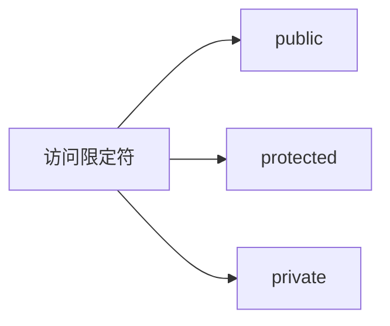

[toc]

# 类和对象

## 面向过程和面向对象初步认识

> - C语言是面向过程，关注的是过程，分析出求解问题的步骤，通过函数调用逐步解决问题。
>
>   体现到代码层面就是函数/方法。
>
> - C++是**基于面向对象**的，关注的是对象，将一件事情拆分成不同的对象，靠对象之间的交互完成。
>
>   关注类对象及类对象间的关系。
>
>   体现到代码层面就是类的设计及类之间的关系。
>
>   > 基于面向对象:可以面向对象和面向过程混编。
>   >
>   > 原因：C++兼容C。

> 经典的面向过程的是：C语言
>
> 经典的面向对象的是：C++、java、go等等
>
> 其中java是纯面向对象

## 类

### struct

其实在我们以前学习C语言的时候就已经学过一种类了，这种最简单的类就是结构体。如下

```c++
struct Student
{
  	//成员变量一般加_
    char _name[20];
    int _age;
    int _studentId;
};
int main()
{
    struct Student s1; //兼容C
    Student s2;        //用类名创建对象，Student类名也是类型。
    return 0;
}
```

因为**C++兼容C**里面结构体的用法，同时struct在C++中也**升级成了类**。

C++类和结构体不同的是除了可以定义变量还可以定义方法/函数。	

```c++
struct Student
{
    //成员变量
    char _name[20];
    int _age;
    int _studentId;
    //成员方法
    void Init(const char* name,int age,int studentId)
    {
        strcpy(_name, name);
        _age = age;
        _studentId = studentId;
    }
  	void Print()
    {
        cout << _name << endl;
        cout << _age << endl;
        cout << _studentId << endl;
    }
};
```

为了区分成员变量与成员方法中的参数，一般在成员变量前加_

我们一般称用类创建的变量为 **对象**。使用对象就可以访问成员变量和成员方法。

```c++
int main()
{
    struct Student s1; //兼容C
    Student s2;        //用类名创建对象
    //旧的方法
    strcpy(s1._name, "YYDS");
    s1._age = 18;
    s1._studentId = 10001;
    //新的方法
    s1.Init("YYDS", 19, 10002);
    s2.Init("Xiaohong", 20, 10003);
    s1.Print();
    s2.Print();
    return 0;
}
```

兼容C的本质是 按照C的用法和定义去用，是完全没有问题的，可以编译通过的。

### class

```c++
class className
{
		//类体，由成员名和成员变量组成
		
};  //和结构体一样都要写分号
```

class为定义类的关键字，ClassName为类的名字，{}中为类的主体，注意类定义结束时后面分号不能省略。

类体中内容称为**类的成员**：类中的变量称为类的属性或成员变量；类中的函数称为类的方法或者成员函数。

如果我们把上面代码的struct改成class再去编译发现失败了，这是为什么呢？

> 面向对象的三大特性是：封装、继承、多态
>
> 其中封装：
>
> C++实现封装的方式：用类将对象的属性与方法结合在一块，让对象更加完善，通过访问权限选择性的将其接口提供给外部的用户使用。
>
> ```mermaid
> graph LR
> 访问限定符-->public
> 访问限定符-->protected
> 访问限定符-->private
> ```
>
> 
>
> 而struct的默认访问权限为public，class的默认访问权限为private。
>
> 但是***一般在定义类的时候，建议明确定义访问限定符，不要用默认限定。***

因为我们用class定义的类的默认访问权限是private，所以我们需要做以下操作。

```c++
class Student
{
    //成员变量
    char _name[20];
    int _age;
    int _studentId;
    //成员方法
public:
    void Init(const char *name, int age, int studentId)
    {
        strcpy(_name, name);
        _age = age;
        _studentId = studentId;
    }

private:
    void Print()
    {
        cout << _name << endl;
        cout << _age << endl;
        cout << _studentId << endl;
    }
};
```

***访问限定符的生效从出现开始，到下一个访问限定符的出现或者类主体结束为止。***

#### 类的访问限定符

C++实现封装的方式：用类将对象的属性与方法结合在一块，让对象更加完善，通过访问权限选择性的将其接口提供给外部的用户使用。



**【访问限定符说明】**

1. public修饰的成员在类外可以直接被访问
2. protected和private修饰的成员在类外不能直接被访问(此处protected和private是类似的）
3. 访问权限作用域**从该访问限定符出现的位置开始直到下一个访问限定符出现时为止**
4. 如果后面没有访问限定符，作用域就到 **}** 即类结束。
5. class的默认访问权限为private，struct为public(因为struct要兼容C)

**注意：访问限定符只在编译时有用，当数据映射到内存后，没有任何访问限定符上的区别**

>问题：C++中struct和class的区别是什么？
>
>解答：C++需要兼容C语言，所以C++中struct可以当成结构体使用。另外C++中struct还可以用来定义类。和class定义类是一样的，区别是struct定义的类默认访问权限是public， class定义的类默认访问权限是private。
>
>注意：在继承和模板参数列表位置，struct和class也有区别，后序再给大家介绍。

#### 封装

面向对象的三大特性：封装、继承、多态。

在类和对象阶段，主要是研究类的封装特性，那什么是封装呢？

> 封裝：将数据和操作数据的方法进行有机结合，隐藏对象的属性和实现细节，仅对外公开接口来和对象进行交互。

> 封装本质上是一种严格管理，让用户更方便使用类。比如：对于电脑这样一个复杂的设备，提供给用户的就只有开关机键、通过键盘输入，显示器，USB插孔等，让用户和计算机进行交互，完成日常事务。但实际上电脑真正工作的却是CPU、显卡、内存等一些硬件元件。

> 对于计算机使用者而言，不用关心内部核心部件，比如主板上线路是如何布局的，CPU内部是如何设计的等，用户只需要知道，怎么开机、怎么通过键盘和鼠标与计算机进行交互即可。因此计算机厂商在出厂时，在外部套上壳子，将内部实现细节隐藏起来，仅仅对外提供开关机、鼠标以及键盘插孔等，让用户可以与计算机进行交互即可。
> 在C++语言中实现封装，可以通过类将数据以及操作数据的方法进行有机结合，通过访问权限来隐藏对象内部实现细节，控制哪些方法可以在类外部直接被使用。

> C语言中，都采取不封装的松散自由管理，所以想访问什么数据都是可以的，但是越自由，就越代表着要明确代码、操作、数据的含义，否则任何修改都是有可能酿成大错的。
>
> 在C++中为了让修改更加严谨不容易出错，采取封装的办法，class的默认操作权限就是private，意味着默认着不让使用者调用修改类里面的数据，而只允许使用者使用编写者已经编写好并且标记为public的接口函数，这样更加安全。

> C++的封装体现在：
>
> 1. 数据和方法都封装到类里面
> 2. 可以给你访问的定义成public，不想给你访问的定义成private 或者 protected。

#### 类的作用域

类定义了一个新的作用域，类的所有成员都在类的作用域中。在类体外定义成员时，需要使用 ***::***  作用域操作符指明成员属于哪个类域。

我们在编写C++项目的时候，首先在头文件内部放类的定义和函数声明，比如：

```c++
//.h
class Stack
{
private:
    int *_a;
    int _capacity;
    int _top;

private:
    void Init();

public:
    void Top();
};
```

```c++
//.cpp
void Stack::Init()
{
    _a = nullptr;
    _top = _capacity = 0;
}
//类外定义需要指定类域
```

#### 类的实例化

> 用类类型创建对象的过程，称为类的实例化
>
> 1. 类是对对象进行描述的，是一个模型一样的东西，限定了类有哪些成员，定义出一个类并没有分配实际的内存空间来存储它；比如：入学时填写的学生信息表，表格就可以看成是一个类，来描述具体学生信息。
>    **类是图纸，对象是按图纸造出来的东西。**
> 2. 一个类可以实例化出多个对象，实例化出的对象 占用实际的物理空间，存储类成员变量。

#### 类对象模型

问题：类中既可以有成员变量，又可以有成员函数，那么一个类的对象中包含了什么？如何计算一个类的大小？

我们对类对象的存储方式进行猜测。

- 对象中包含类的各个成员

  ```mermaid
  graph LR 
  _a-->A(类成员变量)
  top-->A
  _capacity-->A
  Init-->B(类成员函数)
  Top-->B
  
  ```

  

如果是这么储存在内存中，每个对象中成员变量是不同的，但是调用同一份函数，如果按照此种方式存储，当一个类创建多个对象时，每个对象中都会保存一份代码，相同代码保存多次，**非常浪费空间**。

- 只保存一份代码，在对象中保存存放代码的地址
- 只保存成员变量，成员函数存放在公共的代码段。

```c++
//类中既有成员变量，也有成员函数
class A1{
    public:
    void f1(){}
    private:
        int _a;
};
//类中仅有成员函数
class A2{
    public:
    void f2(){}
};
//类中什么都没--空类
class A3{};
int main()
{
    A1 a1;
    A2 a2;
    A3 a3;
    cout << sizeof(a1) << endl;//4
    cout << sizeof(a2) << endl;//1
    cout << sizeof(a3) << endl;//1
  
    return 0;
}
```

通过代码的计算，我们可以得出结论：

> ***结论：一个类的大小，实际就是该类中”成员变量”之和，并且要注意内存对齐。***（C++内存对齐规则与C结构体一致）
>
> ***注意空类和只含有成员函数的类的大小，空类比较特殊，编译器给了空类一个字节来唯一标识这个类的对象。*** -- 这一个字节并不存储有效的数据，而是为了占位，表示这个对象存在而且与其他的不同。

## this指针

```c++
class Date
{
public:
    void Init(int year,int month,int date){
        //Date::year = year
        _year = year;
        _month = month;
        _date = date;
    }
    void Print()
    {
        cout << _year << "-" << _month << "-" << _date << endl;
    }

private:
    //int year;//如果不加_，需要用Date::和函数中形参区分。
    int _year; //加_就是为了区分函数中的形参和实参
    int _month;
    int _date;
};

int main()
{
    Date d1;
    Date d2;
    d1.Init(2022, 10, 15);
    d1.Print();
    d2.Init(2022, 12, 15);
    d2.Print();
    return 0;
}
```

我们发现如果定义两个对象，都是调用同一个函数，但是打印出来的时间却不相同。这是为什么呢？

***因为调用的函数隐藏了this指针。***

```c++
d1.Print(&d1), d2.Print(&d2);
```

d1调用就传了d1的地址，d2调用就传了d2的地址。访问的函数也不是直接执行以下代码：

```c++
    void Print()
    {
        cout << _year << "-" << _month << "-" << _date << endl;
    }
```

而是执行：

```c++
void Print(Date* this){
  	cout << this->_year << "-" << this->_month << "-" << this->_date << endl;
}
```

同样的Init也会被处理成：

```c++
    void Init(Date* const this,int year,int month,int date){
        this->_year = year;
        this->_month = month;
        this-> _date = date;
    }
```

> ***注意：***
>
> 1. 调用成员函数时，不能显示传实参给this。
>
>    ```c++
>    d1.Print(&d1), d2.Print(&d2);//不可以这样！传实参不能显式传给this
>    ```
>
> 2. 定义成员函数时，也不能显示声明形参this。
>
>    ```c++
>    void Init(Date* const this,int year,int month,int date){}//不可以这样！定义时不能显式声明
>    ```
>
> 3. 在成员函数内部，是可以使用this的。
>
>    ```c++
>    this-> _date = date;//可以这样用！在函数内部
>    ```
>
>    但是一般情况下，我们都不会显式地写，没必要。

> 补充一点：
>
> const在*之前，可能会出现权限的放大和缩小：
>
> ```c++
> const int* p1 = nullptr;
> int* p2 = nullptr;
> p1 = p2;//p2给p1是权限的缩小，可读可写->只读
> p2 = p1;//p1给p2是权限的放大，只读->可读可写，会报错
> ```
>
> const在*之后，不会出现，而只是限定这个量只读。