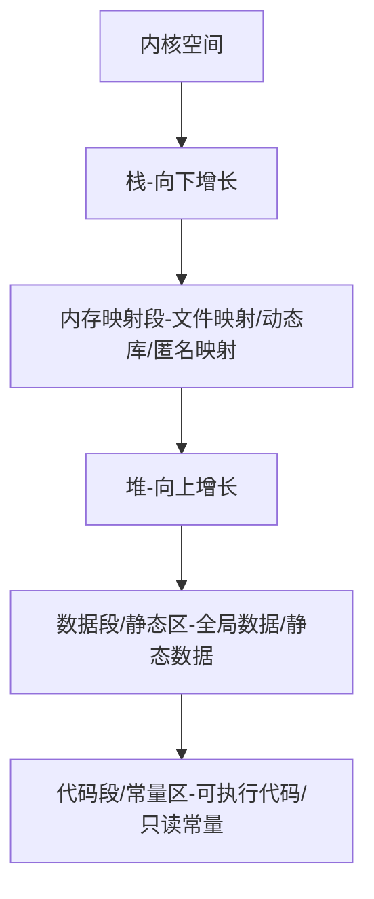

[toc](内存管理)

# 内存管理

## 引子

我们在定义C++的类别和C的类别的时候是有一些区别和联系的。以Stak为例。

> 我们想实现一个栈，
>
> - 在C中，我们只会在类内变量的声明，而接口函数全部都在类外声明和定义。这就说明：
>
>   1. **我们在获取和修改类的成员变量的数据的时候，可以通过调用接口函数的方式，也可以通过自己编写代码来直接实现对成员变量的修改和获取**。
>
>      但是由于本身对类内成员变量的定义是具有多样性的，所以直接写代码修改成员变量是非常容易出现错误的。
>
>   2. 在栈的使用中，我们必须先调用栈的初始化函数，最后使用完后必须进行销毁，而且即便忘记也没有任何提示。
>
> - 所以C++中
>
>   1. 通过类内设置权限和类内定义成员函数的方式进行封装。
>   2. 设定默认成员函数，并且在创建对象和销毁对象的时候不需要自己调用，实现自动创建/销毁。



>- 栈：函数调用建立栈帧、形参、局部变量、数组等等。(Linux-32位8M)
>- 堆：程序运行过程中按需求，申请和释放空间，比如我们实现链表、数组栈等等，都是在堆开空间。(很大)
>- 静态区和常量区大小和栈相近。

> 问题：
>
> ```c++
> int globalVar = 1;
> static int staticGlobalvar = 1;
> void Test()
> {
>     static int staticvar = 1;
>     int localvar = 1;
> 
>     int num1[10] = {1, 2, 3, 4, 5};
>     char char2[] = "abcd";
>     const char *pchar3 = "abcd";
>     int *ptr1 = (int *)malloc(sizeof(int) * 4);
>     int *ptr2 = (int *)calloc(4, sizeof(int));
>     int *ptr3 = (int *)realloc(ptr2, sizeof(int) * 4);
>     free(ptr1);
>     free(ptr3);
> }
> ```
>
> 选项：A.栈 B.堆C.数据段（静态区） D.代码段（常量区)
>
> - globalvar在哪里？
>
>   全局变量在静态区/数据段
>
> - staticGlobalvar在哪里？
>
>   静态全局变量在静态区/数据段
>
> - staticvar在哪里？ 
>
>   静态局部变量在静态区/数据段
>
> - localVar在哪里？
>
>   局部变量在栈
>
> - num1 在哪里？
>
>   数组在栈
>
> - char2在哪里？
>
>   数组在栈 
>
> - *char2在哪里？
>
>   char2是数组，*char2是在栈上开辟的5个空间。
>
> - pchar3在哪里？
>
>   定义在栈上的局部变量-指针要看在哪定义的，定义在全局就是在常量区，定义在局部就是栈
>
> - *pchar3在哪里？
>
>   代码段/常量区
>
> - ptr1在哪里？ 
>
>   在栈上定义指针，然后在堆里开辟空间。
>
> - *ptr1在哪里？
>
>   堆
>
> - sizeof (num1) = 4*10
>
> - sizeof(char2)  = 1*5 还有'\0'
>
> - strlen (char2)  = 4 遇到'\0'中止，不计算在内
>
> - sizeof(pchar3) = 4 指针4字节，64位8字节
>
> - strlen(*pchar3)  = 4 虽然在常量区但是长度是4
>
> - sizeof(ptr1)   = 4/8 (32位/64位) 

> malloc/calloc/realloc的区别
>
> calloc会初始化，相当于，malloc+memset，按照字节初始化，空间每个字节都初始化为0
>
> realloc扩容，原地扩/异地扩

由于C语言动态内存管理比较复杂，会用到malloc、realloc、calloc等不同的动态内存函数，还需要强制类型转换(void*)为所需要的类型，所以C++想尝试用更加简单的方式，这就是new和delete。

## C++内存管理方式

c语言内存管理方式在C++中可以继续使用，但有些地方就无能为力，而且使用起来比较麻烦，因此C++又提出了自己的内存管理方式：通过new和delete操作符进行动态内存管理。

```c++
int main()
{
    int *p1 = (int *)malloc(sizeof(int));
    int *p2 = (int *)malloc(sizeof(int) * 10);

    int *p3 = new int;
    int *p4 = new int[10];//动态申请10个int空间，区别(10)，(10)是开辟一个int空间，初始化为10.
//C++98不支持初始化new数组
//C++11支持，用法：int* pr = new int[10]{1,2,3,4,5};
//未初始化的自动置0
    free(p1);
    free(p2);
    delete p3;
    delete[] p4;
		p1 = nullptr;
    p2 = nullptr;
  	p3 = nullptr;
  	p4 = nullptr;
    return 0;
}
```

对比一下， 其实malloc/free 和 new/delete 对于内置类型没有本质区别，只有用法区别。那为什么C++花心思重新设计new和delete呢？

这是因为在动态开辟自定义类型空间时：

- new 作用是：在对上申请对象空间 + 调用构造函数初始化对象
- delete ：先调用指针类型析构函数 + 释放空间给堆
- 而且new和calloc不一样，calloc是粗暴的把空间都全部置0，而new调用自定义类型的构造函数并非简单置0，可以初始化为任何想要的值。

>注意：申请和释放单个元素的空间，使用new和delete操作符，申请和释放连续的空间，使用new[]和delete[]，注意：匹配起来使用。

> 注意：在申请自定义类型的空间时，new会调用构造函数，delete会调用析构函数，而malloc与free不会。

> 面向对象的语言，处理错误的方式一般是抛异常，c++中也要求出错抛异常(try catch)；面向过程的语言，处理错误的方式是返回值加错误码解决。
>
> 而new失败以后要求抛异常，这样才符合面向对象语言的出错处理机制。
>
> > ps: delete 和 free一般不会失败，如果失败了，都是释放空间上存在越界或者释放指针位置不对。

举一个例子：

```c++
class Stack
{
public:
    Stack(int capacity = 4)
        :_top(0)
        ,_capacity(capacity)
    {
        _a = new int[capacity];
    }
    ~Stack()
    {
        delete[] _a;
        _a = nullptr;
        _capacity = _top = 0;
    }
private:
    int *_a;
    int _top;
    int _capacity;
};

int main()
{
    Stack st1; //函数里面的局部变量在栈上
    //如果我们想在堆上构造一个栈
    Stack *pst2 = new Stack;//开空间+构造函数初始化
    //pst2指向动态开辟的空间，指向栈对象
    //主动释放

    delete pst2;//析构函数(清理对象中的资源) + 释放空间
    return 0;
}
```

### operator new/delete 函数

new和delete是用户进行动态内存申请和释放的操作符，operator new 和operator delete是系统提供的全局函数，new在底层调用operator new全局函数来申请空间，delete在底层通过operator delete全局函数来释放空间。

operator new：该函数**实际通过malloc来申请空间**，当malloc申请空间成功时直接返回；申请空间失败，尝试执行空间不足应对措施，如果改应对措施用户设置了，则继续申请，否则抛异常。

> operator new 实际也是**通过malloc**来申请空间，如果malloc申请空间成功就直接返回，否则执行用户提供的空间不足应对措施，如果用户提供该措施就继续申请，否则就**抛异常**。operator delete **最终是通过free**来释放空间的。

> 那么为什么new不是调用malloc来进行动态开辟空间，而是使用了operator new这个全局函数来实现呢？
>
> **这是因为**如果使用malloc，而因为内存不足等原因导致开辟空间失败，malloc会采取返回错误码的方式来处理错误，这是C语言出现错误处理的方式，但是C++这种基于面向对象的语言更习惯也更喜欢抛异常的方式来处理错误，所以它专门设计operator new全局函数来实现错误情况下抛异常的处理错误方式。

## new/delete实现原理

### 内置类型

如果申请的是内置类型的空间，new和malloc, delete和free基本类似，不同的地方是：
new/delete申请和释放的是单个元素的空间，new[]和delete[]申请的是连续空间，而且new在申请空间失败时会抛异常，malloc会返回NULL。

### 自定义类型

- new的原理
  1. 调用operator new函数申请空间
  2. 在申请的空间上执行构造函数，完成对象的构造
- delete的原理
  1. 在空间上执行析构函数，完成对象中资源的清理工作
  2. 调用operator delete函数释放对象的空间
- new T[N]]的原理

  1. 调用operator new[]函数，在operator new[]中实际调用operator new函数完成N个对象空间的申请
  2. 在申请的空间上执行N次构造函数
- delete[]的原理
  1. 在释放的对象空间上执行N次析构函数，完成N个对象中资源的清理
  2. 调用operator delete[]释放空间，实际在operator delete[]中调用operator delete来释放空间

### 手动实现operator new重载

我们先简单实现一个双向带头循环链表。

```c++
class ListNode
{
public:
    ListNode(int data)
        : _next(nullptr), _prev(nullptr), _data(data)
    {
    }

    ListNode *_next;
    ListNode *_prev;
    int _data;
};
class List
{
public:
    List()
    {
        _head = new ListNode(-1);
        _head->_next = _head;
        _head->_prev = _head;
    }
    ~List()
    {
        ListNode* cur = _head->_next;
        while(cur!= _head)
        {
            ListNode *next = cur->_next;
            delete cur;
            cur = next;
        }
        delete _head;
        _head = nullptr;
    }
    void PushBack(int val)
    {
        ListNode *newnode = new ListNode(val);
        ListNode *tail = _head->_prev;
        tail->_next = newnode;
        newnode->_prev = tail;
        _head->_prev = newnode;
        newnode->_next = _head;
    }
    void Print()
    {
        ListNode *tail = _head->_prev;
        ListNode *head = _head->_next;
        while (tail != head->_prev)
        {
            cout << head->_data << endl;
            head = head->_next;
        }
    }

private:
    ListNode *_head;
};
int main()
{
    List l;
    l.PushBack(1);
    l.PushBack(2);
    l.PushBack(3);
    l.PushBack(4);
    l.PushBack(5);
    l.Print();
    return 0;
}
```

可以实现简单的尾插了。但是我们发现，我们每尾插一次，都会调用new，new又会调用operator new和构造函数，operator new又会使用malloc，都会去向堆上申请开辟空间，这是非常浪费效率的。

我们补充内存池的概念：

>**默认内存管理函数的不足**
>
>利用默认的内存管理操作符 new/delete 和函数 malloc()/free() 在堆上分配和释放内存会有一些额外的开销。
>
>系统在接收到分配一定大小内存的请求时，首先查找内部维护的内存空闲块表，并且需要根据一定的算法（例如分配最先找到的不小于申请大小的内存块给请求者，或者分配最适于申请大小的内存块，或者分配最大空闲的内存块等）找到合适大小的空闲内存块。如果该空闲内存块过大，还需要切割成已分配的部分和较小的空闲块。然后系统更新内存空闲块表，完成一次内存分配。类似地，在释放内存时，系统把释放的内存块重新加入到空闲内存块表中。如果有可能的话，可以把相邻的空闲块合并成较大的空闲块。默认的内存管理函数还考虑到多线程的应用，需要在每次分配和释放内存时加锁，同样增加了开销。
>
>可见，如果应用程序频繁地在堆上分配和释放内存，会导致性能的损失。并且会使系统中出现大量的内存碎片，降低内存的利用率。默认的分配和释放内存算法自然也考虑了性能，然而这些内存管理算法的通用版本为了应付更复杂、更广泛的情况，需要做更多的额外工作。而对于某一个具体的应用程序来说，适合自身特定的内存分配释放模式的自定义内存池可以获得更好的性能。
>
>> **内存池（Memory Pool）**是一种内存分配方式。通常我们习惯直接使用new、malloc等API申请内存，这样做的缺点在于所申请内存块的大小不定，当频繁使用时会造成大量的内存碎片并进而降低性能。
>>
>> > **内存池的优点:**
>> >
>> > 内存池则是在真正使用内存之前，预先申请分配一定数量、大小相等（一般情况下）的内存块留作备用。当有新的内存需求时，就从内存池中分出一部分内存块，若内存块不够再继续申请新的内存。这样做的一个显著优点是，使得内存分配效率得到提升。

如果我们设定自己专属的operator new重载，在ListNode里面写一个operator new重载，让operator new不再使用malloc找堆申请空间，用allocator*<STL中的内存池-空间配置器>*

## 定位new表达式(placement-new)

> 定位new表达式是在己分配的原始內存空间中调用构造函数初始化一个对象。
>
> > 使用格式：new (place_address) type或者new (place_address) type(initializer-list)
>
> place address必须是一个指针，initializer-list是类型的初始化列表。
>
> > 使用场景：定位new表达式在实际中一般是配合内存池使用。因为内存池分配出的内存没有初始化，所以如果是自定义类型的对象，需要使用new的定义表达式进行显示调构造函数进行初始化。

## 题目

1. malloc/free和new/delete的区别

> malloc/free和new/delete的
>
> 共同点是：都是从堆上申请空间，并且需要用户手动释放。
>
> 不同的地方是：从用法和底层两个角度理解
>
> 1. malloc和free是函数，new和delete是操作符
> 2. malloc申请的空间不会初始化，new可以初始化
> 3. malloc申请空间时，需要手动计算空间大小并传递，new只需在其后跟上空间的类型即可，如果是多个对象，[]中指定对象个数即可
> 4. malloc的返回值为void*，在使用时必须强转，new不需要，因为new后跟的是空间的类型
> 5. malloc申请空问失败时，返回的是NULL，因此使用时必须判空，new不需要，但是new需要捕获异常
> 6. 申请自定义类型对象时，malloc/free只会开辟空间，不会调用构造函数与析构函数，而new在申请空间后会调用构造函数完成对象的初始化，delete在释放空间前会调用析构函数完成空间中资源的清理

2. 内存泄漏

   > 什么是内存泄漏，内存泄漏的危害？
   >
   > 什么是内存泄漏：内存泄漏指因为疏忽或错误造成程序**未能释放已经不再使用的内存的情况**。内存泄漏并不是指内存在物理上的消失，而是应用程序分配某段内存后，因为设计错误，失去了对
   > 该段內存的控制，因而造成了内存的浪费。
   >
   > 内存泄漏的危害：
   >
   > 1. 出现内存泄漏的进程正常结束，晋城结束时这些内存会被自动释放，不会有很大的危害
   > 2. 需要长期运行的程序出现內存泄漏，影响很大，如操作系统、后台服务等等，出现内存泄漏会导致响应越来越慢，最终卡死。
   > 3. 出现内存泄漏的进程非正常结束，比如僵尸进程
