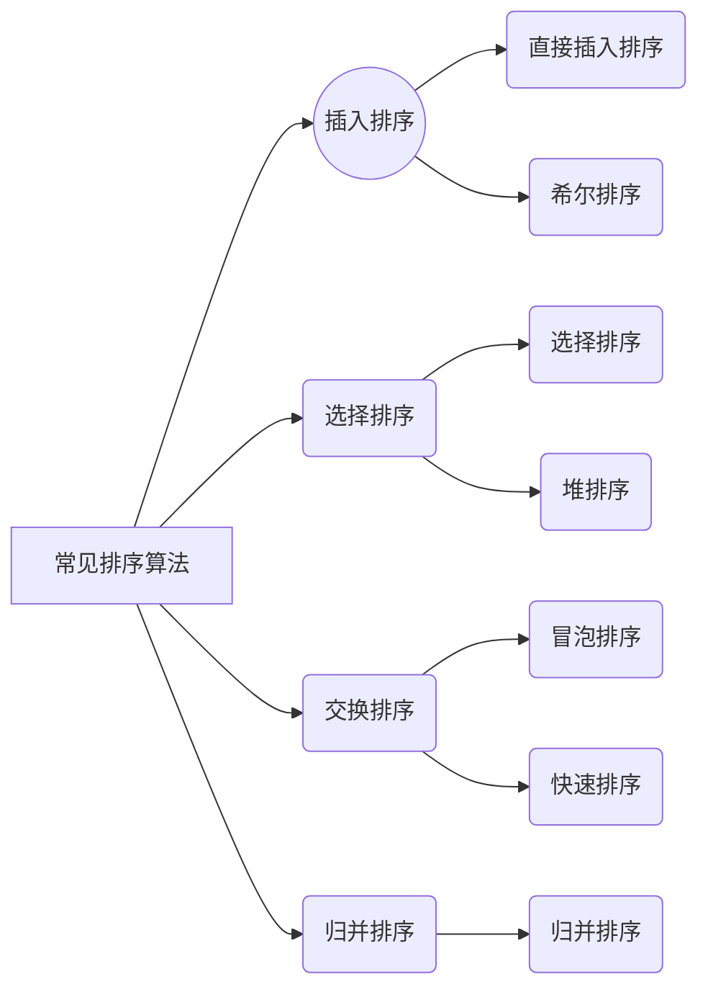
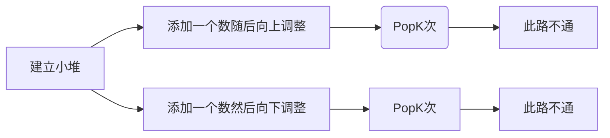
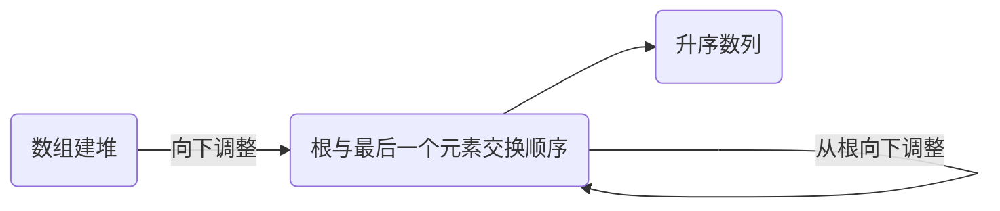
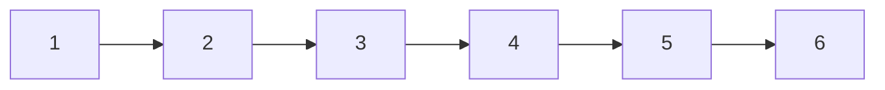
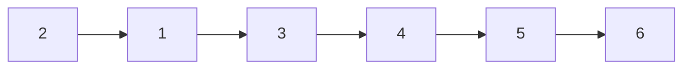

# 排序

## 排序的概念

>O (N)是排序的时间复杂度的天花板



# 常见排序算法的实现

## 直接插入排序

>  直接插入排序是一种简单的插入排序法，基本思想就是：把带排序的记录按照关键码值的大小逐个插入到一个已经排好序的有序序列中，直到所有的记录插入完为止，得到一个新的有序序列。

### 编写思路

将x插入到[0,end]的有序区间的单趟排序。

```c
//假设排序都为升序

void InsertSort(int *a, int n)
{
    assert(a);
    //要插入的数比这个数大，放在这个数后面
    int end;
    int x;
    while (end >= 0)
    {
        //比这个数小，这个数往后挪一个
        if (a[end] > x)
        {
            a[end + 1] = a[end];
            --end;
        }
        else
        {
            break;
        }
    }
    a[end + 1] = x;
}
```

> 如果想要让一个无序的数组变为有序：
>
> 只需要把x一个一个的放进来即可。

### 代码展示

```c
void InsertSort(int *a, int n)
{
    assert(a);
    //进行循环，注意边界
    for (int i = 0; i < n - 1; i++)
    {
        //单趟的排序
        int end = i;
        int x = a[end + 1];
        while (end >= 0)
        {
            if (a[end] > x)
            {
                a[end + 1] = a[end];
                --end;
            }
            else
            {
                break;
            }
        }
        a[end + 1] = x;
    }
}
```

### 时间复杂度

> - **时间复杂度: O (N^2^)**
>  - *最好的情况是： -- 接近顺序有序或者顺序有序O(N)*
>   - *最坏的情况是： -- 逆序（全部重新拍）**O(N^2^)***
> - **空间复杂度: O (1)**

## 希尔排序

希尔排序(Shell's Sort)是插入排序的一种又称“缩小增量排序”（Diminishing Increment Sort），是直接插入排序算法的一种更高效的改进版本。**希尔排序是非稳定排序算法**。该方法因 D.L.Shell 于 1959 年提出而得名。希尔排序是把记录按下标的一定增量分组，对每组使用直接插入排序算法排序；随着增量逐渐减少，每组包含的关键词越来越多，当增量减至 1 时，整个文件恰被分成一组，算法便终止。

希尔排序是基于插入排序的以下两点性质而提出改进方法的：

- 插入排序在对几乎已经排好序的数据操作时，效率高，即可以达到线性排序的效率。
- 但插入排序一般来说是低效的，因为插入排序每次只能将数据移动一位。
  

>Shell sort is **a generalized version of the insertion sort algorithm**. It first sorts elements that are far apart from each other and successively reduces the interval between the elements to be sorted. The interval between the elements is reduced based on the sequence used.
>
>**Space Complexity:** O(1)
>
>**Worst:** O(n2)
>
>**Average:** O(nlog n)

因为插入排序接近有序时非常快，我们可以用

1. 分组预排序 -- 数组接近有序
2. 直接插入排序

将数组分成gap组，对分组值进行插入排序。

我们按照 如下的顺序依次来进行编写


### 预排序

```c
//单趟预排序
void ShellSort(int *a, int n)
{
    //按gap分组，堆数据进行预排序
    //单趟的 只是拍了a[0] 、 a[3]这两个数
    //如果要排end end+gap end+2*gap ... 我们需要再写一个循环
    int gap = 3;
    int end = 0;
    int x = a[end + gap];
    while(end>=0)
    {
        if(a[end]>x)
        {
            a[end + gap] = a[end];
            end -= gap;
        }
        else
        {
            break;
        }
    }
    a[end + gap] = x;
}
```

```c
void ShellSort(int *a, int n)
{
    //按gap分组，堆数据进行预排序
    //单趟的 只是拍了a[0] 、 a[3]这两个数
    //如果要排end end+gap end+2*gap ... 我们需要再写一个循环
    int gap = 3;
    for (int i = 0; i < n - gap;i+=gap)
    {
        int end = i;
        int x = a[end + gap];
        while (end >= 0)
        {
            if (a[end] > x)
            {
                a[end + gap] = a[end];
                end -= gap;
            }
            else
            {
                break;
            }
        }
        a[end + gap] = x;
    }
    //循环写好了，但是这只是a[0]/a[3]/a[6]/a[9]
    //需要写好整个数组的排列，就需要再套一层循环来调节end的值
}
```

```c
//最终的预排序
void ShellSort(int *a, int n)
{
    //按gap分组，堆数据进行预排序
    //单趟的 只是拍了a[0] 、 a[3]这两个数
    //如果要排end end+gap end+2*gap ... 我们需要再写一个循环
    //循环写好了，但是这只是a[0]/a[3]/a[6]/a[9]
    //需要写好整个数组的排列，就需要再套一层循环来调节end的值
    int gap = 3;
    for (int j = 0; j < gap; j++)
    {
        for (int i = j; i < n - gap; i += gap)
        {
            int end = i;
            int x = a[end + gap];
            while (end >= 0)
            {
                if (a[end] > x)
                {
                    a[end + gap] = a[end];
                    end -= gap;
                }
                else
                {
                    break;
                }
            }
            a[end + gap] = x;
        }
    }
}
```

时间复杂度：

- 最好是O (N)
- 最坏是F(N,gap) = (1+2+3 + ... + N/gap)*gap

gap越大，预排越快，同时预排后越不接近有序

gap越小，预排序越慢。预排后越接近有序。极限情况就是gap=1就是直接插入排序了。

但是刚才的预排序是一组组的来，如果我们***再进行优化，变成多组一锅炖***，情况就会稍微简单一些。

```c
//多组一锅炖
void ShellSort(int *a, int n)
{
    int gap = 3;
    for (int i; i < n - gap; i++)
    {
        int end = i;
        int x = a[end + gap];
        while (end >= 0)
        {
            if (a[end] > x)
            {
                a[end + gap] = a[end];
                end -= gap;
            }
            else
            {
                break;
            }
        }
        a[end + gap] = x;
    }
}
```

之前是一组排完排序下一组，这个变成了， 排完a[0]与a[3]的排a[1]与a[4]的，以此类推。这样就可以少进行一个循环，比较简单。

### gap的控制

>gap越大，预排越快，同时预排后越不接近有序
>
>gap越小，预排序越慢。预排后越接近有序。极限情况就是gap=1就是直接插入排序了。

该控制gap了，试想，我们的gap在大于1时是在进行预排序，等于1时是在进行直接插入。这样预排序好后的直接插入是最节省时间的。

```c
void ShellSort(int *a, int n)
{
    //多次预排序(gap>1) + 直接插入(gap==1)
    int gap = n;
    while(gap>1)
    {
        // gap = gap/2;
        gap = gap / 3 + 1;//预排序少一些，但是可能会出现2/3 = 0 的情况，所以需要加1.
        //保证到1是因为gap=1时才可以直接插入。
    for (int i; i < n - gap; i++)
    {
        int end = i;
        int x = a[end + gap];
        while (end >= 0)
        {
            if (a[end] > x)
            {
                a[end + gap] = a[end];
                end -= gap;
            }
            else
            {
                break;
            }
        }
        a[end + gap] = x;
    }
    }
}
```

这就是最终版本了。

### 时间复杂度

对gap的控制比较简单，gap/2/2/2.... ，时间复杂度大概就是log~2~N

下面循环，分为

- gap很大的情况，由最坏情况的F(N) 为(1+2+3+..+N/（N/2）)*N/2，即最坏情况下也是O(N)
- gap很小的情况下，已经接近有序了，时间复杂度也为O(N)

所以大概理解时间复杂度就是两个相乘**O(N*log~2~N)**

## 直接选择排序

### 代码展示

```c
//最简单的
//遍历一遍选出最大放到最后
//再遍历一遍选出剩下的最大的放到后面，以此类推
//这样很慢！O（N*N）
//我们尝试用一次选一个最大的和一个最小的，这样就把效率提升一倍，但总体来说还是很慢
void Swap(int *px, int *py)
{
    int tmp = *px;
    *px = *py;
    *py = tmp;
}
void SeletSort(int *a, int n)
{
    int begin = 0, end = n - 1;
    //我们在这里需要选择的是最小值和最大值的下标，否则一旦将其覆盖掉就不清楚了。
    while (begin < end)
    {
        int min = begin, max = begin;
        for (int i = begin; i <= end; i++)
        {
            if (a[i] < a[min]) //如果a[i]最小
            {
                //记录下标
                min = i;
            }
            if (a[i] > a[max])
            {
                max = i;
            }
            //交换
            //Swap(&a[begin], &a[min]);
            //Swap(&a[end], &a[max]);
            //这里会出问题，如果max就是他的begin，begin和max重叠了，明明a[min]和a[begin]已经换过了，但是因为max下标没动，导致初始位置又和end发生交换了。
            Swap(&a[begin], &a[min]);
            if (begin == max)
            {
                max = min;
            }
            Swap(&a[end], &a[max]);
        }
        begin++;
        end--;
    }
}
```

### 时间复杂度

虽然经过了优化，但是时间复杂度还是应为：**O(N^2^)**

- 最好的情况就是虽然全部有序，但是程序拿到数组之后都要经过遍历才能判断出最大值最小值。所以仍旧是O(N^2^)

所以选择排序是最烂、最慢排序。（虽然代码很简单

## 堆排序

### 编写思路

先建堆，然后进行堆排序。

排升序，按理来说需要找出最小值，然后找出次小的值，以此类推，这样思考的话我们需要建立小堆，**但是！！**，



试想如果建立小堆，无论是向上调整，还是向下调整，如果删掉堆顶数据，从堆顶的下一个位置视作堆顶。那么之前建立好的堆的关系就全部乱了，必须重新排列重新建堆，那么时间复杂度会飙升->O(N*N)。(这个时间复杂度还不如遍历选数呢)

所以**我们需要建大堆**：

因为大堆的向下调整必须要求根的左右子树都为大堆，所以我们需要从倒数第一个叶子节点的父节点开始向下调整。随后减减父亲节点的下标，就可以逐个找到所有的父亲节点，并且正好是整棵树都向下调整完毕。

这样子我们就选出了根节点(最大值)，随后让其与数组中的最后一个元素交换位置，然后屏蔽掉最后一个元素(最大值已经找到了，就可以把它屏蔽掉了)

随后向下调整，以此类推，就可以找到最大值，次大值，.....，最后选出最小值。



### 代码展示

```c
void HeapSort(int *a, int n)
{
    for (int i = (n - 1 - 1) / 2; i >= 0;i--)
    {
        AdjustDown(a, n, i);
    }
    int end = n - 1;
    while(end>0)
    {
        Swap(&a[0], &a[end]);
        AdjustDown(a, end--, 0);
    }
}
```

### 时间复杂度

时间复杂度为：O(N*log~2~N)，类似于ShellSort

## 冒泡排序

冒泡排序和快速排序都是属于交换排序。

### 编写思路

冒泡排序的思想就是前一个如果比后一个大的话就交换位置（排升序）。这样一次可以找出来一个最大值，所以我们需要再嵌套循环n次。

首先我们还是写一趟的循环。

```c
    for (int i = 1; i < n;i++)
    {
        if(a[i-1]>a[i])
        {
            Swap(a[i - 1], a[i]);
        }
        i++;
    }
```

嵌套循环：

```c
//最终代码
void BubbleSort(int *a, int n)
{
    //冒泡排序就是前一个比后一个大就交换
    for (int j = 0; j < n;j++)
    {
        for (int i = 1; i < n-j; i++)
        {
            if (a[i - 1] > a[i])
            {
                Swap(a[i - 1], a[i]);
            }
            i++;
        }
    }
}
```

### 代码优化

冒泡排序还是可以进行一定的优化的：

可以考虑下面这种情况：



相邻的两个数 前数都小于后一个数，这就代表数组以及就有序。我们可以加一个变量来判断是否发生过交换，如果没发生过交换，那么就已经有序了。

```c
void BubbleSort(int *a, int n)
{
    //冒泡排序就是前一个比后一个大就交换
    for (int j = 0; j < n;j++)
    {
      	int exchange = 0;
        for (int i = 1; i < n-j; i++)
        {
            if (a[i - 1] > a[i])
            {
                Swap(a[i - 1], a[i]);
            }
            i++;
          if(exchange)
     		   {
            break;
     		   }
        }
    }
}
```

同样的，它也适用于接近有序的情况，考虑



交换完一次后，第二轮的循环开始，发现exchange为0，说明并为交换，那么循环中止，完成排序。

### 时间复杂度

冒泡排序是典型的O(N^2^)排序。

- 最坏情况是N^2^
- 最好情况是N

## 选择排序、直接插入排序、冒泡排序的比较

这三个排序都是时间复杂度O(N^2^)级别的排序，所以可以拿出来比较一下。

选择排序无疑是最差的，因为它无论最好情况还是最坏情况都是O(N^2^)。

而直接插入排序和冒泡排序，最好情况是O(N)。但是虽然最好情况相同，**直接插入排序更优**。因为：

- 对于已经有序的数组排序，一样好。
- 对于接近有序的数组，直接插入排序更好。
- 综合来说，直接插入排序对局部有序的数组的适应性更优。

所以，直接插入排序更好。

考虑如下数组：


- 冒泡排序比了：n-1 + n-2 次

- 直接插入比了：n次

## 快速排序

### hoare版本

#### 编写思路

一般选择最左边/最右边做key，单趟排序的目标是：左边的值比key要小，右边的值比key大，key来到了正确的地方了。所以要求

- 左边找到大，右边找小，都找到之后交换顺序，

- 注意最左边做key值时，需要右边先走（此时左右相遇点比key小）。右边做key，左边先走（此时左右相遇点比key大）。

- 左边和右边最终会相遇，相遇点跟左边的key位置的值要交换。

  ```c
  void PartQuickSort(int *a, int n)
  {
      int left = 0;
      int right = n - 1;
      int key = 0;
      //单趟
      //找到比key小的值
      while (right < left)
      {
        	//左边先走
          while (a[right] > a[key])
          {
              right--;
          }
          while (a[left] < a[key])
          {
              left++;
          }
          Swap(a[right], a[left]);
      }
      Swap(a[right], a[key]);
  }
  ```

  考虑下面两个特殊情况

  ```mermaid
  graph LR
  1-->2-->3-->4-->5
  ```

  会导致right找不到比key小的数，但是right--并不会中止程序最终导致越界。所以需要加对循环中止的判断。

  ```mermaid
  graph LR
  A(5)-->B(5)-->C(5)-->D(5)-->E(5)
  ```

  程序判断的时候不会进入两个while语句，直接立即交换，会陷入死循环。所以需要修改>为>=，方便进入循环。

  所以正确的单趟快排代码如下：

  ```c
  void PartQuickSort(int *a, int left,int right)
  {
      int key = left;
      //单趟
      //找到比key小的值
      while (right > left)
      {
          //左边先走
          while (right > left && a[right] >= a[key])
          {
              right--;
              //如果面临 5 6 7 8 9 的情况
              //就会排序排出去加个判断
          }
          while (right > left && a[left] <= a[key])
          {
              left++;
          }
          Swap(&a[right], &a[left]);
      }
      Swap(&a[right], &a[key]);
  }
  ```

  单趟排完，比key小的都在左边，比key大的都在右边。如果两个子区间有序，那就整体有序了。左、右子区间再进行快排，左子区间的左右子区间再进行快排，以此类推，进行一个递归。

  ```c
  void QuickSort(int *a, int left, int right)
  {
      if (left >= right)
          return;
      int key = PartQuickSort(a, left, right);
      QuickSort(a, left, key - 1);
      QuickSort(a, key + 1, right);
  }
  ```

#### 时间复杂度

考虑一种极限情况，如果每次key都是选到中位数，那么其排序过程就类似于二叉树。

单趟情况的是O(N)

考虑每次找到key，key的左边和右边元素个数相加起来依旧接近于N，进行快速排序递归的次数为log~2~N，所以时间复杂度近似于：O(N*log~2~N)

#### 快排的缺陷

key选最左边，如果单趟排完序之后key依然在很靠左的位置，那么会导致它的时间复杂度为O(N^2^)。

递归程序缺陷：

- 相比循环程序，性能差。(针对早期编译器是这样。因为对于递归调用，建立栈帧优化不大。现在新编译器优化很好，递归的性能与循环相比差不了多少)
- 递归深度太深，会导致栈溢出。

如何解决快排面对有序数列选key的问题呢？

- 随机选key ()
- 三数取中，在左边中间和右边三者中选不大不小的值。

接下来我们用三数取中去优化hoare版本代码。

#### 代码优化

三数取中，我们先写一个三数取中函数。

```C
int GetMidIndex(int *a, int left, int right)
{
    // int mid = (left + right) / 2;
    int mid = left + (right - left) / 2; //减少溢出
    // int mid = left + ((right-left)>>1);//移位和上面的没差别，但是移位运算优先级低，要注意加括号。
    if (a[left] < a[mid])
    {
        if (a[mid] < a[right])
            return mid;
        else if (a[right] < a[left])
            return left;
        else
            return right;
    }
    else
    {
        if (a[mid] > a[right])
            return mid;
        else if (a[left] > a[right])
            return right;
        else
            return left;
    }
}
```

这样选择中位数之后，是不是就违背了我们key选最左，从右开始找的原则呢？是的。因此，我们需要继续调整，把找出来的中间值换到最左边去，从而让代码逻辑一致。

```c
int PartQuickSort(int *a, int left, int right)
{
    //三数取中
    int mid = GetMidIndex(a, left, right);
    Swap(&a[mid], &a[left]);
    int key = left;
    //单趟
    //找到比key小的值
    while (right > left)
    {
        //左边先走
        while (right > left && a[right] >= a[key])
        {
            right--;
            //如果面临 5 6 7 8 9 的情况
            //就会排序排出去加个判断
        }
        while (right > left && a[left] <= a[key])
        {
            left++;
        }
        Swap(&a[right], &a[left]);
    }
    Swap(&a[right], &a[key]);
    return right;
}
```

三数取中，让原来有序的最坏情况，通过选中位数做key，变成了最好情况。

### 挖坑法

挖坑法是hoare版本的变形，主要针对于原来key选左边，要从右边先走的问题。

左边key位置挖坑（存储key的值），然后坑的位置在right的左侧，所以right向左走，找比key小的值放到坑里。right的位置变成新的坑，坑的位置在left右边，所以left向右走。直到二者相遇中止。

```c
void Partion(int *a, int left, int right)
{
    //三数取中
    int mid = GetMidIndex(a, left, right);
    Swap(&a[mid], &a[left]);
    int key = a[left];
    int hole = left;
    while (right > left)
    {
        while (a[right] >= key && right > left)
        {
            right--;
        }
        a[hole] = a[right];
        hole = right;
        while (left < right && a[left] <= key)
        {
            left++;
        }
        a[hole] = a[left];
        hole = left;
    }
    a[hole] = key;
    key = hole;
    return key;
}
```

挖坑法的性能与hoare版本并没有本质的区别，只是略优，因为不用再处理key在左边，先走右边的步骤了。

### 前后指针作key

