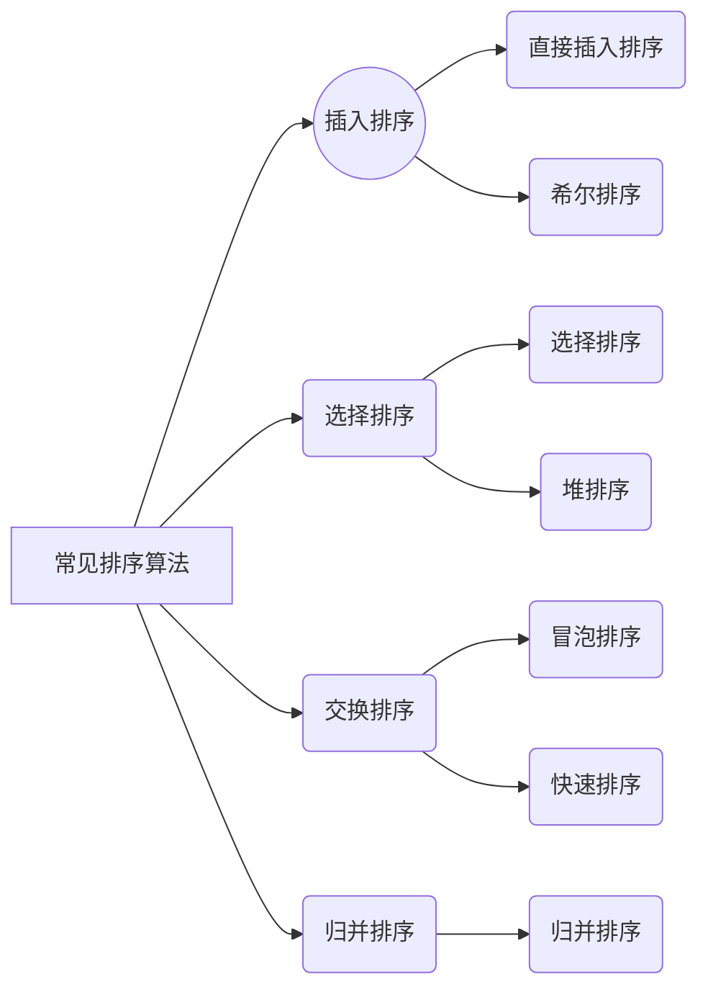

# 排序

## 排序的概念

>O (N)是排序的时间复杂度的天花板



# 常见排序算法的实现

## 插入排序

### 直接插入排序

>  直接插入排序是一种简单的插入排序法，基本思想就是：把带排序的记录按照关键码值的大小逐个插入到一个已经排好序的有序序列中，直到所有的记录插入完为止，得到一个新的有序序列。

将x插入到[0,end]的有序区间的单趟排序。

```c
//假设排序都为升序

void InsertSort(int *a, int n)
{
    assert(a);
    //要插入的数比这个数大，放在这个数后面
    int end;
    int x;
    while (end >= 0)
    {
        //比这个数小，这个数往后挪一个
        if (a[end] > x)
        {
            a[end + 1] = a[end];
            --end;
        }
        else
        {
            break;
        }
    }
    a[end + 1] = x;
}
```

> 如果想要让一个无序的数组变为有序：
>
> 只需要把x一个一个的放进来即可。

```c
void InsertSort(int *a, int n)
{
    assert(a);
    //进行循环，注意边界
    for (int i = 0; i < n - 1; i++)
    {
        //单趟的排序
        int end = i;
        int x = a[end + 1];
        while (end >= 0)
        {
            if (a[end] > x)
            {
                a[end + 1] = a[end];
                --end;
            }
            else
            {
                break;
            }
        }
        a[end + 1] = x;
    }
}
```

> **插入排序的**
>
> - **时间复杂度: O (N^2^)**
>   - *最好的情况是： -- 接近顺序有序或者顺序有序O(N)*
>   - *最坏的情况是： -- 逆序（全部重新拍）O(N^2^)*
> - **空间复杂度: O (1)**

## 希尔排序

希尔排序是直接插入排序的思想上的优化。

>Shell sort is **a generalized version of the insertion sort algorithm**. It first sorts elements that are far apart from each other and successively reduces the interval between the elements to be sorted. The interval between the elements is reduced based on the sequence used.
>
>**Space Complexity:** O(1)
>
>**Worst:** O(n2)
>
>**Average:** O(nlog n)

因为插入排序接近有序时非常快，我们可以用

1. 分组预排序 -- 数组接近有序
2. 直接插入排序

将数组分成gap组，对分组值进行插入排序。

我们按照 如下的顺序依次来进行编写


### 预排序

```c
//单趟预排序
void ShellSort(int *a, int n)
{
    //按gap分组，堆数据进行预排序
    //单趟的 只是拍了a[0] 、 a[3]这两个数
    //如果要排end end+gap end+2*gap ... 我们需要再写一个循环
    int gap = 3;
    int end = 0;
    int x = a[end + gap];
    while(end>=0)
    {
        if(a[end]>x)
        {
            a[end + gap] = a[end];
            end -= gap;
        }
        else
        {
            break;
        }
    }
    a[end + gap] = x;
}
```

```c
void ShellSort(int *a, int n)
{
    //按gap分组，堆数据进行预排序
    //单趟的 只是拍了a[0] 、 a[3]这两个数
    //如果要排end end+gap end+2*gap ... 我们需要再写一个循环
    int gap = 3;
    for (int i = 0; i < n - gap;i+=gap)
    {
        int end = i;
        int x = a[end + gap];
        while (end >= 0)
        {
            if (a[end] > x)
            {
                a[end + gap] = a[end];
                end -= gap;
            }
            else
            {
                break;
            }
        }
        a[end + gap] = x;
    }
    //循环写好了，但是这只是a[0]/a[3]/a[6]/a[9]
    //需要写好整个数组的排列，就需要再套一层循环来调节end的值
}
```

```c
//最终的预排序
void ShellSort(int *a, int n)
{
    //按gap分组，堆数据进行预排序
    //单趟的 只是拍了a[0] 、 a[3]这两个数
    //如果要排end end+gap end+2*gap ... 我们需要再写一个循环
    //循环写好了，但是这只是a[0]/a[3]/a[6]/a[9]
    //需要写好整个数组的排列，就需要再套一层循环来调节end的值
    int gap = 3;
    for (int j = 0; j < gap; j++)
    {
        for (int i = j; i < n - gap; i += gap)
        {
            int end = i;
            int x = a[end + gap];
            while (end >= 0)
            {
                if (a[end] > x)
                {
                    a[end + gap] = a[end];
                    end -= gap;
                }
                else
                {
                    break;
                }
            }
            a[end + gap] = x;
        }
    }
}
```

时间复杂度：

- 最好是O (N)
- 最坏是F(N,gap) = (1+2+3 + ... + N/gap)*gap

gap越大，预排越快，同时预排后越不接近有序

gap越小，预排序越慢。预排后越接近有序。极限情况就是gap=1就是直接插入排序了。

但是刚才的预排序是一组组的来，如果我们***再进行优化，变成多组一锅炖***，情况就会稍微简单一些。

```c
//多组一锅炖
void ShellSort(int *a, int n)
{
    int gap = 3;
    for (int i; i < n - gap; i++)
    {
        int end = i;
        int x = a[end + gap];
        while (end >= 0)
        {
            if (a[end] > x)
            {
                a[end + gap] = a[end];
                end -= gap;
            }
            else
            {
                break;
            }
        }
        a[end + gap] = x;
    }
}
```

之前是一组排完排序下一组，这个变成了， 排完a[0]与a[3]的排a[1]与a[4]的，以此类推。这样就可以少进行一个循环，比较简单。

### gap的控制

>gap越大，预排越快，同时预排后越不接近有序
>
>gap越小，预排序越慢。预排后越接近有序。极限情况就是gap=1就是直接插入排序了。

该控制gap了，试想，我们的gap在大于1时是在进行预排序，等于1时是在进行直接插入。这样预排序好后的直接插入是最节省时间的。

```c
void ShellSort(int *a, int n)
{
    //多次预排序(gap>1) + 直接插入(gap==1)
    int gap = n;
    while(gap>1)
    {
        // gap = gap/2;
        gap = gap / 3 + 1;//预排序少一些，但是可能会出现2/3 = 0 的情况，所以需要加1.
        //保证到1是因为gap=1时才可以直接插入。
    for (int i; i < n - gap; i++)
    {
        int end = i;
        int x = a[end + gap];
        while (end >= 0)
        {
            if (a[end] > x)
            {
                a[end + gap] = a[end];
                end -= gap;
            }
            else
            {
                break;
            }
        }
        a[end + gap] = x;
    }
    }
}
```

这就是最终版本了。

### 时间复杂度的计算

对gap的控制比较简单，gap/2/2/2.... ，时间复杂度大概就是log~2~N

下面循环，分为

- gap很大的情况，由最坏情况的F(N) 为(1+2+3+..+N/（N/2）)*N/2，即最坏情况下也是O(N)
- gap很小的情况下，已经接近有序了，时间复杂度也为O(N)

所以大概理解时间复杂度就是两个相乘O(N*log~2~N)

